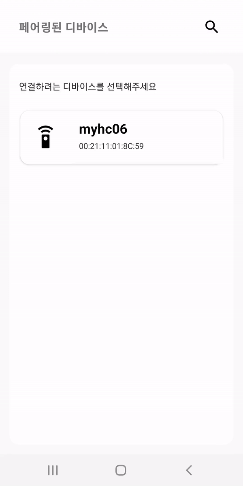

# Android-Bluetooth-chat-sample
* 안드로이드 ['blueBerry'](https://play.google.com/store/apps/details?id=com.limjuhyg.blueberry) 애플리케이션의 [테스트 모드]에서 일부 사용되고 있는 소스 코드입니다.
    
---

### 목차
[1. 개요](#개요)

[2. 개발환경](#개발환경)

[3. 미리보기](#미리보기)

[4. 준비](#준비)

[5. RecyclerView](#recyclerview)

[6. 예제 - ChatUI](#chatui)

[7. 예제 - BluetoothChat](#구현된-채팅ui에-블루투스-통신-연결)


---

### 개요
1. RecyclerView를 이용한 채팅UI를 만들고 블루투스 시리얼 통신으로 메시지를 주고 받는 예제입니다.
2. 멀티스레드 환경에서 비동기적으로 메시지를 주고받을 수 있습니다.
3. 라즈베리파이 또는 아두이노와 연결해서 테스트해볼 수 있습니다.
4. 예제는 클라이언트 전용입니다. 연결요청을 받는 서버 소켓 구현은 [라즈베리파이/아두이노 서버 생성 예제](https://github.com/Android-blueBerry)에서 확인하세요.

---

### 개발환경
* Platform <b>Android</b>
* Language <b>Kotlin 1.5</b>
* Library <b>RecyclerView, Thread/Handler, BluetoothSocket</b>
​
---

### 미리보기
라즈베리파이 또는 아두이노와 연결을 통해 아래와 같은 결과물을 만들 수 있습니다.

  

---

### 준비
1. 모듈 수준 build.gradle 파일에 RecyclerView를 추가해 주세요.

```kotlin
    // RecyclerView
    implementation "androidx.recyclerview:recyclerview:1.2.1"
    implementation "androidx.recyclerview:recyclerview-selection:1.1.0"
```

---

### RecyclerView
* <b>RecyclerView</b>는 개발자가 각 항목의 레이아웃을 정의하여 데이터를 제공할 수 있습니다. 제공된 데이터는 RecyclerView 라이브러리가 필요할 때 요소를 동적으로 생성합니다. 또한 요소가 스크롤되어 화면에서 벗어나더라도 RecyclerView는 해당 뷰를 제거하지 않고 필요할 때 다시 재활용하게됩니다. 이러한 방식은 앱의 응답성을 개선하므로 성능이 개선됩니다. 요소를 동적으로 생성해야 할 경우 ListView 보다는 RecyclerView를 사용해야 합니다. -[<i>Create dynamic lists with RecyclerView</i>](https://developer.android.com/guide/topics/ui/layout/recyclerview)  

### 구현해야하는 클래스 및 메소드

* <b>ViewHolder</b>  
  ViewHolder는 목록의 각 개별 뷰가 저장되는 클래스입니다. ViewHolder클래스에 있는 뷰들은 계속해서 새로 생성하지 않고 재사용되며 뷰가 필요로 할 때 마다 뷰에 데이터를 연결하는 프로세스(binding)를 거칩니다.  
  
* <b>onCreateViewHolder()</b>  
  ViewHolder를 새로 만들어야 할 때마다 이 메소드가 호출됩니다. ViewHolder와 이에 속한 View들을 생성하고 초기화합니다.

* <b>onBindViewHolder()</b>  
  viewHolder에 데이터를 연결할 때 이 메소드가 호출됩니다. 이 메소드에서 뷰의 레이아웃에 적절한 데이터를 채우는 과정을 구현해야합니다.
  
* <b>getItemCount()</b>  
  RecyclerView가 데이터셋의 크기를 필요로 할 때 이 메소드를 호출합니다.

---

### ChatUI
* 블루투스 시리얼 통신 부분은 생략하고 채팅UI만 구현되어 있습니다.
* 채팅UI가 RecyclerView로 어떻게 구현되었는지 확인할 수 있습니다.
​​​​​

1. ChatActivity의 레이아웃에 RecyclerView를 적절하게 배치해 주세요.
```xml
<!-- activity_chat.xml -->

<androidx.recyclerview.widget.RecyclerView
        android:id="@+id/chat_view"
        android:layout_width="match_parent"
        android:layout_height="0dp"
        android:paddingStart="20dp"
        android:paddingEnd="20dp"
        app:layout_constraintTop_toBottomOf="@id/remote_device_panel"
        app:layout_constraintBottom_toTopOf="@+id/panel_margin">
</androidx.recyclerview.widget.RecyclerView>
```

2. 채팅UI를 구성하는 RecyclerView의 레이아웃을 생성해 주세요.
* 채팅UI는 보내는 쪽의 뷰와 받은 쪽의 뷰를 따로 구성해야합니다.
* 보내는 쪽의 텍스트 뷰는 오른쪽, 받는 쪽의 텍스트 뷰는 왼쪽으로 배치합니다. 그러고나서 메시지를 보낼 때는 보내는 쪽의 텍스트 뷰만 표시하고 받는 쪽의 텍스트 뷰는 숨겨야 합니다. 반대의 경우에도 한 쪽은 숨기고 한 쪽만 표시합니다. 이는 뷰의 visibility 속성을 이용하면 편리합니다.  

```xml
<!-- recycler_view_chat.xml -->
<?xml version="1.0" encoding="utf-8"?>
<androidx.constraintlayout.widget.ConstraintLayout xmlns:android="http://schemas.android.com/apk/res/android"
    xmlns:app="http://schemas.android.com/apk/res-auto"
    android:layout_width="match_parent"
    android:layout_height="wrap_content"
    android:layout_marginTop="20dp"
    android:layout_marginStart="20dp"
    android:layout_marginEnd="20dp">

    <!-- 보내는 쪽 -->
    <androidx.constraintlayout.widget.Group
        android:id="@+id/send_layout"
        android:layout_width="wrap_content"
        android:layout_height="wrap_content"
        app:constraint_referenced_ids="send_text_view, send_time"
        android:visibility="gone"/>

    <TextView
        android:id="@+id/send_text_view"
        android:layout_width="0dp"
        android:layout_height="wrap_content"
        android:textSize="16sp"
        android:background="@drawable/send_text_view_background"
        android:paddingTop="7dp"
        android:paddingBottom="7dp"
        android:paddingStart="10dp"
        android:paddingEnd="10dp"
        app:layout_constrainedWidth="true"
        app:layout_constraintWidth_percent="0.7"
        app:layout_constraintWidth_max="wrap"
        app:layout_constraintRight_toRightOf="parent"
        app:layout_constraintTop_toTopOf="parent"/>

    <TextView
        android:id="@+id/send_time"
        android:layout_width="wrap_content"
        android:layout_height="wrap_content"
        android:textSize="12sp"
        android:paddingTop="6dp"
        app:layout_constraintTop_toBottomOf="@+id/send_text_view"
        app:layout_constraintRight_toRightOf="@+id/send_text_view"/>

    <!-- 받는 쪽 -->
    <androidx.constraintlayout.widget.Group
        android:id="@+id/receive_layout"
        android:layout_width="wrap_content"
        android:layout_height="wrap_content"
        app:constraint_referenced_ids="receive_text_view, receive_time"
        android:visibility="gone"/>

    <TextView
        android:id="@+id/receive_text_view"
        android:layout_width="0dp"
        android:layout_height="wrap_content"
        android:textSize="16sp"
        android:background="@drawable/receive_text_view_background"
        android:paddingTop="7dp"
        android:paddingBottom="7dp"
        android:paddingStart="10dp"
        android:paddingEnd="10dp"
        app:layout_constrainedWidth="true"
        app:layout_constraintWidth_percent="0.7"
        app:layout_constraintWidth_max="wrap"
        app:layout_constraintLeft_toLeftOf="parent"
        app:layout_constraintTop_toTopOf="parent"/>

    <TextView
        android:id="@+id/receive_time"
        android:layout_width="wrap_content"
        android:layout_height="wrap_content"
        android:textSize="12sp"
        android:paddingTop="6dp"
        app:layout_constraintTop_toBottomOf="@+id/receive_text_view"
        app:layout_constraintLeft_toLeftOf="@+id/receive_text_view"/>
</androidx.constraintlayout.widget.ConstraintLayout>
```

3. RecyclerView Adapter 구현  
* 먼저 RecyclerView에 사용될 데이터 클래스가 생성되어 있어야합니다. ChatRecyclerView에 사용될 데이터는 보내는 쪽/받는 쪽 방향을 구분할 수 있도록 하는 direction 변수와 message, 보낸 시간/받은 시간을 기록하는 time변수가 있습니다.
``` kotlin
data class ChatItem(val direction: Int, val message: String, val time: Long)
```

* RecyclerView.Adapter를 상속받는 ChatRecyclerViewAdatper 클래스를 생성해 주세요.

``` kotlin
class ChatRecyclerViewAdapter : RecyclerView.Adapter<ChatRecyclerViewAdapter.ViewHolder>() {
    private val chatItems by lazy { ArrayList<ChatItem>() }

    companion object {
        const val DIRECTION_SEND: Int = 0
        const val DIRECTION_RECEIVE: Int = 1
    }
}
```
  
* ChatRecyclerViewAdapter.ViewHolder는 아직 구현되지 않은 상태입니다. 뷰를 저장하는 ViewHolder 객체를 생성해야합니다. Group타입인 sendLayout 및 receiveLayout은 각 TextView들을 묶고 있습니다(XML에 정의). 따라서 Group 타입을 가진 뷰들의 visibility를 변경하면 자동으로 각 TextView들도 함께 변경됩니다.
``` kotlin
inner class ViewHolder(view: View) : RecyclerView.ViewHolder(view) {
    // send
    val sendLayout: Group = view.findViewById(R.id.send_layout)
    val sendMessage: TextView = view.findViewById(R.id.send_text_view)
    val sendTime: TextView = view.findViewById(R.id.send_time)

    // receive
    val receiveLayout: Group = view.findViewById(R.id.receive_layout)
    val receiveMessage: TextView = view.findViewById(R.id.receive_text_view)
    val receiveTime: TextView = view.findViewById(R.id.receive_time)
}
```

* onCreateViewHolder 메소드를 오버라이드합니다. RecyclerView에 사용될 레이아웃을 Inflate하여 ViewHolder에 넘겨주면서 ViewHolder 객체를 생성합니다.
``` kotlin
override fun onCreateViewHolder(parent: ViewGroup, viewType: Int): ViewHolder {
    val view = LayoutInflater.from(parent.context).inflate(R.layout.recycler_view_chat, parent, false)
    return ViewHolder(view)
}
```

* onBindViewHolder 메소드를 오버라이드하여 뷰홀더 객체에 데이터를 바인딩합니다. 데이터를 연결할 때 direction으로 구분하여, 보내는 경우 receiveLayout의 뷰들은 숨기고 sendLayout의 뷰들만 표시합니다. 반대의 경우도 한 쪽 뷰 그룹은 숨겨야 합니다.

``` kotlin
override fun onBindViewHolder(viewHolder: ViewHolder, position: Int) {
    val item = chatItems[position]

    viewHolder.apply {
        if(item.direction == DIRECTION_SEND) { // Send
            receiveLayout.visibility = View.GONE
            sendLayout.visibility = View.VISIBLE
            sendMessage.text = item.message
            sendTime.text = formatTime(item.time)
        }
        else if(item.direction == DIRECTION_RECEIVE) { // Receive
            sendLayout.visibility = View.GONE
            receiveLayout.visibility = View.VISIBLE
            receiveMessage.text = item.message
            receiveTime.text = formatTime(item.time)
        }
    }
}

// ... //
private fun formatTime(time: Long) = SimpleDateFormat("kk:mm:ss", Locale.getDefault()).format(time)
```

* RecyclerView가 데이터셋의 크기를 알 수 있도록 getItemCount() 메소드를 오버라이드합니다.
``` kotlin
override fun getItemCount() = chatItems.size
```

* 액티비티에서 RecyclerView에 데이터를 추가할 수 있도록 addItem 메소드를 생성해 주세요. 
아이템 셋에 데이터를 추가한 후 notifyItemInserted 메소드를 사용하면 RecyclerView는 데이터가 추가된 것을 알고 onBindViewHolder 메소드를 호출시킵니다. 아래 코드처럼 notifyItemInserted 메소드를 사용한 경우 RecyclerView의 맨 아래 항목에 데이터를 추가합니다. 이외에도, 아이템이 변동되는 경우 notifyDataSetChanged(), 아이템이 삭제되는 경우 notifyItemRemoved() 메소드를 사용할 수 있습니다.
``` kotlin
fun addItem(direction: Int, message: String, time: Long) {
    val item = ChatItem(direction, message, time)
    chatItems.add(item)
    notifyItemInserted(chatItems.size-1)
}
```

4. 추가적으로 RecyclerView에 아이템 클릭 이벤트를 추가하고 싶은 경우 다음처럼 구현할 수 있습니다.

* 먼저 RecyclerViewAdapter 내부에 OnItemClickListener에 대한 인터페이스를 구현합니다.
``` kotlin
interface OnItemClickListener {
    fun onItemClick(view: View, position: Int)
}
```

* 다음은 인터페이스로 구현된 OnItemClickListener를 받는 변수를 전역변수로 선언합니다. 그리고 다음처럼 ViewHolder 내부에서 View와 position 값을 전달할 수 있습니다.
``` kotlin
// ... //
private lateinit var onItemClickListener: OnItemClickListener

inner class ViewHolder(view: View) : RecyclerView.ViewHolder(view) {
    // ... //

    init {
        view.setOnClickListener {
            val position = bindingAdapterPosition
            if(position != RecyclerView.NO_POSITION) onItemClickListener.onItemClick(view, position)
        }
    }
}
```

* 마지막으로 액티비티에서 호출할 수 있는 콜백함수를 정의해 주세요.
``` kotlin
fun setOnItemClickListener(listener: OnItemClickListener) {
    onItemClickListener = listener
}
```
 
 
* 이제 액티비티에서 아래처럼 아이템 클릭 리스너를 호출할 수 있습니다.
``` kotlin
myRecyclerViewAdapter.setOnItemClickListener(object: MyRecyclerViewAdapter.OnItemClickListener {
    override fun onItemClick(view: View, position: Int) {
        // ... //
    }
})
```

---

### 구현된 RecyclerView 사용하기
* RecyclerView를 사용하기 전에 구현된 RecyclerViewAdapter 객체를 생성하고 LayoutManager를 통해 뷰의 배치를 정의해야 합니다. 기본적으로 <b>LinearLayoutManager</b>를 사용하여 뷰를 가로 또는 세로로 배치할 수 있으며 <b>GridLayoutManager</b>를 사용하여 뷰를 격자 형태로 배치할 수도 있습니다. 뷰의 배치를 정의했다면 RecyclerView에 구현된 Adapter를 연결합니다.

``` kotlin
private val chatRecyclerViewAdapter by lazy { ChatRecyclerViewAdapter() }

// 기본형은 수직 배치이며 가로 배치는
// binding.chatView.layoutManager 
//   = LinearLayoutManager(this, LinearLayoutManager.HORIZONTAL, false)
binding.chatView.layoutManager = LinearLayoutManager(this) // 수직 배치
binding.chatView.adapter = chatRecyclerViewAdapter

// 애니메이션이 필요한 경우
// val animation = AnimationUtils.loadAnimation(this, R.anim.to_top_from_bottom_2)
// binding.chatDeviceRecyclerView.animation = animation
```

* 필요에 따라 RecyclerView의 스크롤 위치를 변경할 수도 있습니다. 아래는 스크롤을 맨 마지막 항목에 위치시키는 코드입니다.
``` kotlin
myRecyclerView.smoothScrollToPosition(myRecyclerViewAdapter.itemCount-1)
```

* RecyclerView에 항목을 추가하고 싶은 경우 구현한 addItem 메소드를 사용하면 됩니다. 이제 RecyclerView는 필요할 때마다 동적으로 항목을 생성하게됩니다.
``` kotlin
override fun onResume() {
    super.onResume()
    binding.btnSend.setOnClickListener {
        val sendMessage = binding.editText.text.toString()
        // 보내는 방향
        chatRecyclerViewAdapter.addItem(
            ChatRecyclerViewAdapter.DIRECTION_SEND, 
            sendMessage, 
            System.currentTimeMillis()
        )

        // 받는 방향
        val receivedMessage = sendMessage // Sample
        chatRecyclerViewAdapter.addItem(
            ChatRecyclerViewAdapter.DIRECTION_RECEIVE, 
            receivedMessage, 
            System.currentTimeMillis()
        )

        chatView.smoothScrollToPosition(chatRecyclerViewAdapter.itemCount-1)
    }
}
```

---

### 구현된 채팅UI에 블루투스 통신 연결
* 안드로이드에서 제공하는 Bluetooth API를 통해 라즈베리파이/아두이노와 연결할 수 있는 채팅 클라이언트를 설계해 보도록 하겠습니다.
* 서버 소켓에 연결 요청을 보내는 connect() 메소드와 상대방 소켓으로부터 보내온 메시지를 읽는 read() 메소드는 메인 스레드를 중단시킵니다. 안드로이드의 메인 스레드는 오직 UI 업데이트를 위해서만 사용되어야 하기 때문에 새로운 스레드에서 작업해야 합니다. 멀티스레딩을 구현하는 방식은 여러 가지가 있지만 예제에서는 Thread/Handler를 통해 구현했습니다.

### Thread/Handler
* Thread: 자바에서 기본적으로 제공하는 Thread API는 프로그램 내에서 새로운 스레드를 만들어 동작할 수 있도록 설계되어 있습니다. run() 메소드를 오버라이드하여 간단하게 구현할 수 있지만 스레드 내에서 발생된 데이터를 메인 스레드로 전달하기 위해서는 Handler라는 객체가 필요합니다.

* Handler: 핸들러를 사용하면 서브 스레드에서 발생한 데이터를 메인 스레드로 전달할 수 있습니다. 안드로이드는 반드시 메인 스레드에서만 UI를 업데이트할 수 있기 때문에 서브 스레드에서 발생된 데이터로 UI를 업데이트 해야하는 경우 반드시 Handler 객체가 필요합니다.

### Connect Thread(Client) 구현
* 먼저 열린 서버 소켓에 연결 요청하는 과정을 구현해야 합니다. 블루투스 시리얼 통신은 RFCOMM 프로토콜을 사용하며 안드로드에서 Bluetooth API로 이를 지원합니다. 연결할 BluetoothDevice 객체를 전달 받아 createRfcommSocketToServiceRecord() 메소드를 사용하여 클라이언트용 RFCOMM소켓을 생성합니다.

* <주의>createRfcommSocketToServiceRecord() 메소드는 UUID 값을 인자로 받습니다. 블루투스 시리얼 통신은 시리얼 포트 프로파일을 사용하기 때문에 랜덤한 UUID를 설정해서는 안됩니다. UUID.fromString 메소드를 사용해서 시리얼 포트 프로파일의 UUID(<b>"00001101-0000-1000-8000-00805F9B34FB"</b>)를 전달해 주세요.  

``` kotlin
class ClientConnectThread(
    private val bluetoothDevice: BluetoothDevice,
    private val messageHandler: Handler
) : Thread() {
    private val rfcommSocket: BluetoothSocket by lazy {
        bluetoothDevice.createRfcommSocketToServiceRecord(
            UUID.fromString("00001101-0000-1000-8000-00805F9B34FB")
        )
    }

    companion object {
        const val CONNECT_SUCCESS = 1
        const val CONNECT_FAIL = 0
    }

    // ... //
```


* run() 메소드를 오버라이드하여 연결을 정의합니다. connect() 메소드를 통해 연결에 성공한다면 Handler를 통해서 'CONNECT_SUCCESS' 메시지와 함께 통신할 수 있는 Socket 데이터를 전달합니다.
``` kotlin
override fun run() {
    try {
        rfcommSocket.connect() // 연결될 때 까지 대기하거나 exception을 발생시킵니다.
        if(!isInterrupted) {
            val message = messageHandler.obtainMessage(CONNECT_SUCCESS, rfcommSocket)
            message.sendToTarget()
        }

    } catch (e: IOException) {
        // .. 연결에 실패한 경우 .. //
        cancel()
        if(!isInterrupted) {
            val message = messageHandler.obtainMessage(CONNECT_FAIL)
            message.sendToTarget()
        }
    }
}

// ... //
```

* 액티비티에서 Handler 객체를 구현합니다. 서브 스레드에서 보낸 메시지와 데이터를 전달받을 수 있습니다. 필요하다면 전달 받은 데이터를 가지고 UI 업데이트를 진행할 수 있습니다.
``` kotlin
// ChatActivity
// ... //
override fun onCreate(savedInstanceState: Bundle?) {
    // ... //

    messageHandler = object: Handler(Looper.getMainLooper()) {
        override fun handleMessage(msg: Message) {
            when(msg.what) { // 메시지 종류를 구분합니다. (CONNECT_SUCCESS, CONNECT_FAIL, ... )
                CONNECT_SUCCESS -> { // 연결에 성공한 경우
                    // Update UI
                    // ... //

                    val rfcommSocket = msg.obj as BluetoothSocket // 데이터를 받습니다.

                    // Communication Thread 를 실행합니다.
                    communicationThread = ClientCommunicationThread(rfcommSocket, messageHandler)
                    communicationThread!!.start()
                }

                CONNECT_FAIL -> { // 연결에 실패한 경우
                    // Update UI
                    // ... //
                }

                // ... //

    connectThread = ClientConnectThread(bluetoothDevice!!, messageHandler)
    connectThread!!.start()
}
```

### Communication Thread 구현
* 연결에 성공해서 얻은 rfcommSocket 객체를 가지고 CommunicationThread를 생성해서 데이터 교환 로직을 설계해야 합니다. 먼저 소켓을 통해 InputStream, OutputStream을 생성하고 데이터를 실을 버퍼를 생성합니다.
``` kotlin
class ClientCommunicationThread(
    private val rfcommSocket: BluetoothSocket,
    private val messageHandler: Handler
) : Thread() {
    private val inputStream: InputStream = rfcommSocket.inputStream
    private val outputStream: OutputStream = rfcommSocket.outputStream
    private val readBuffer: ByteArray = ByteArray(1024) // Buffer size

    companion object {
        const val MESSAGE_READ: Int = 101
        const val MESSAGE_WRITE: Int = 102
        const val CONNECT_CLOSE: Int = 100
    }

    // ... //
```

* run() 메소드를 오버라이드하여 데이터를 받는 로직을 설계합니다. read() 메시지로 정상적인 읽기에 성공한다면 핸들러를 통해 메시지를 전달합니다. 중간에 연결이 끊길 경우 Exception이 발생됩니다.
``` kotlin
override fun run() {
    var messageLength: Int
    while (true) {
        if(isInterrupted) break
        messageLength = try {
            inputStream.read(readBuffer) // readBuffer 에 메시지를 읽습니다.

        } catch (e: IOException) { // 연결이 끊기면 발생
            cancel()
            val message = messageHandler.obtainMessage(CONNECT_CLOSE)
            message.sendToTarget()
            break
        }

        // 읽은 메시지를 메인 스레드로 전달합니다.
        val receivedMessage = String(readBuffer.copyOf(messageLength))
        val message = messageHandler.obtainMessage(MESSAGE_READ, receivedMessage)
        message.sendToTarget()
    }
}
```

* 메시지 쓰기는 스레드를 중단시키지 않습니다. 따라서 run() 메소드 내부에 구현할 필요가 없습니다. CommunicationThread 클래스 내부에 write() 메소드만 아래와 같이 생성해 주세요.
``` kotlin
fun write(bytes: ByteArray) {
    try {
        outputStream.write(bytes) // 연결된 블루투스 디바이스로 메시지를 전달합니다.

        // 전송 성공 메시지를 메인 스레드로 전달합니다.
        val message = messageHandler.obtainMessage(MESSAGE_WRITE, String(bytes, Charsets.UTF_8))
        message.sendToTarget()

    } catch (e: IOException) {
        cancel()
    }
}
```

* 이제 액티비티에서 Handler를 통해 메시지 및 데이터를 전달 받을 수 있습니다. 전달 받은 데이터를 통해 UI를 업데이트합니다.
``` kotlin
messageHandler = object: Handler(Looper.getMainLooper()) {
    override fun handleMessage(msg: Message) {
        when(msg.what) {
            // ... //

            CONNECT_CLOSE -> { // 연결이 끊어진 경우
                // 디바이스와 연결이 종료된 경우를 처리할 수 있습니다.
                // TODO
                Toast.makeText(this@ChatActivity, "디바이스와 연결이 종료되었습니다.", Toast.LENGTH_SHORT).show()
                finish()
            }

            MESSAGE_READ -> { // 원격 디바이스로부터 메시지를 읽은 경우
                val receivedMessage = msg.obj as String
                // 리사이클러뷰에 받은 메시지를 추가합니다.
                chatRecyclerViewAdapter.addItem(DIRECTION_RECEIVE, receivedMessage, System.currentTimeMillis())
                binding.chatView.smoothScrollToPosition(chatRecyclerViewAdapter.itemCount-1) // 자동 스크롤
            }

            MESSAGE_WRITE -> { // 원격 디바이스로 메시지 보내기를 성공한 경우
                // 성공적인 메시지 전송 결과를 처리할 수 있습니다.
                // TODO
            }
        }
    }
}
```

* EditText에 입력된 문자열 데이터를 가지고 CommunicationThread에 정의된 write() 메소드를 아래처럼 사용할 수 있습니다.
``` kotlin
override fun onResume() {
    super.onResume()

    // ... //

    // 메시지 전송
    binding.apply {
        btnSend.setOnClickListener {
            // Update chat view
            if(isButtonAccessible) {
                val sendMessage = editText.text.toString()
                chatRecyclerViewAdapter.addItem(DIRECTION_SEND, sendMessage, System.currentTimeMillis())
                chatView.smoothScrollToPosition(chatRecyclerViewAdapter.itemCount-1) // 자동 스크롤
                editText.setText("")

                communicationThread!!.write(sendMessage.toByteArray(Charsets.UTF_8))
            }
        }
    }
}
```

### 스레드 종료
* 통신이 종료되고 액티비티가 Destroy될 때 메모리 누수를 방지하기 위해서 스레드를 중단 시켜야합니다. 기본적으로 스레드는 run() 메소드가 모두 실행되고 나면 자동으로 종료되지만 위의 코드처럼 무한루프를 통해 어떤 동작을 반복하고 있다면 스레드가 정상적으로 종료되지 않을 수도 있습니다. 스레드는 경우에 따라서 개발자가 종료시킬 수 있도록 interrupt() 메소드를 제공하고 있습니다. interrupt() 메소드는 스레드가 sleep 상태에서 InterruptedException을 발생시켜 스레드를 멈추도록 할 수 있습니다. 하지만 이를 위해서 스레드 내부에서는 sleep 코드를 의도적으로 추가해야 합니다. 다른 방법으로는 스레드 내부에서 isInterrupted 를 사용하는 것입니다. interrupt() 메소드에 의해 isInterrupted의 값이 true로 변경되고 이에 따라 run 메소드에서 동작하던 무한 루프를 벗어나 하던 일을 마치도록하여 스레드를 안전하게 종료시킬 수 있습니다.
``` kotlin
override fun onDestroy() {
    super.onDestroy()
    
    // 스레드가 중단되지 않았다면 interrupt를 걸고 사용하고 있던 소켓 자원을 해제합니다.
    connectThread?.let { thread ->
        if(!thread.isInterrupted) {
            thread.interrupt()
            thread.cancel()
        }
    }
    communicationThread?.let { thread ->
        if(!thread.isInterrupted) {
            thread.interrupt()
            thread.cancel()
        }
    }
}
```